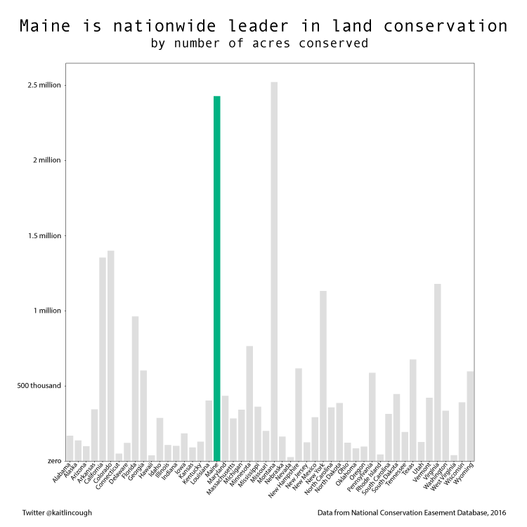
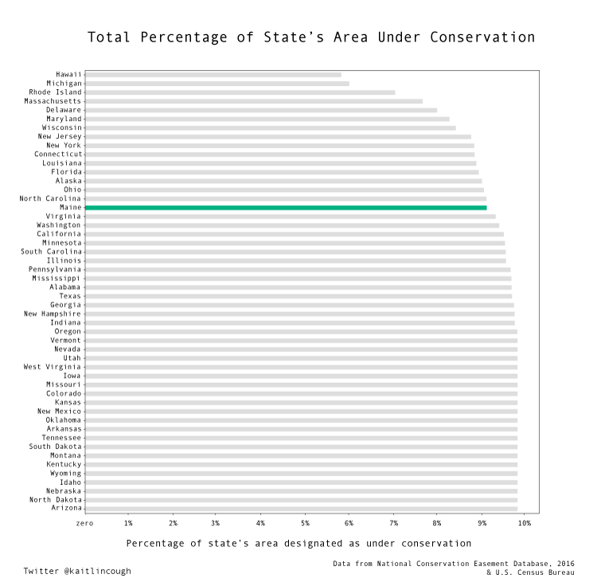

---

title: Conservation Lands
layout: project

---

# Maine is a leader in conserving land for future generations

**Land conservation plays a vital role in Maine's economy.** Locals and tourists alike enjoy access to millions (yes millions) of acres of land where development has been limited. 

**Much of this land is privately held,** either in conservation easements (a legal agreement between a land trust and a private landowner that puts permanent restrictions on what can be done with the land, with an eye toward conserving it) or by non-profits and non-governmental-organizations, who are often gifted land or sold land by donors and manage that land for public use. As an example, the Goslings, in Casco Bay, were sold to Maine Coast Heritage Trust by the islands' previous owners at a steep discount, with contributions for the purchase coming from public and private donations as well as a grant from Land for Maine's Future. 

**The Maine Land Trust Network,** a program of Maine Coast Heritage Trust (Maine's largest land non-profit land trust), lists 67 land trusts in the state, managing 475,554 acres of land. The majority (63 percent) is managed by The Nature Conservancy of Maine, a branch of the national organization The Nature Conservancy. Maine Coast Heritage Trust manages the greatest number of parcels.
As for the state, three organizations (The Maine Bureau of Parks and Lands, the Maine Dept. of Inland Fisheries & Wildlife, and the Maine Minor Civil Division) manage the majority of the properties. Maine Coast Heritage Trust manages the largest number of individual holdings.

land managed by private organizations|land managed by the state
:-------------------------:|:-------------------------:
|

land managed by the federal government|land managed by municipalities
:-------------------------:|:-------------------------:
||

**At 9.14 percent, Maine lags slightly behind nationwide** in terms of the percentage of the state's area that is marked for conservation, but the numbers area close: percentage-wise, Arizona leads the nationwide, at 9.85 percentage of the state's area under conservation. 

