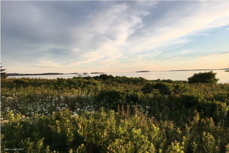
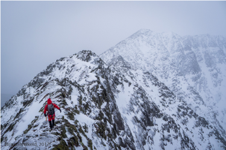

---

title: Conservation Lands
layout: project

---

# Maine is a leader in conserving land for future generations. But most of Maine's conserved land is privately managed.

| Pond Island | Mount Katahdin | Acadia National Park |
|:---:|:---:|:---:|
| |||
|Pond Island, managed by the non-profit Maine Coast Heritage Trust|Mount Katahdin, managed by the state as part of Baxter State Park|Acadia National Park, managed by the federal government as part of the National Parks System|

**Land conservation plays a vital role in Maine's economy.** Locals and tourists alike enjoy access to over two and a half million acres of forests, lakes and rivers where development has been limited through conservation easements and other protections. Only Montana has more land under conservation by acreage.

**However, despite having one of the highest acreage counts of conserved land,** at 9.14 percent, Maine lags slightly behind nationwide in terms of the percentage of the state's area that is marked for conservation. But the numbers are close: Arizona leads the nation in conservation, at 9.85 percentage of the state's area designated as conserved lands.

**But although Maine is a conservation leader, the majority of conserved land in the state--nearly 60 percent--is privately held** either in conservation easements (a legal agreement between a land trust and a private landowner that puts permanent restrictions on what can be done with the land, with an eye toward conserving it) or by non-profits and non-governmental-organizations, who are often gifted land or sold land by donors and manage that land for public use. As an example, the Goslings, in Casco Bay, were sold to Maine Coast Heritage Trust by the islands' previous owners at a steep discount, with contributions for the purchase coming from public and private donations as well as a grant from Land for Maine's Future. 

**The Maine Land Trust Network,** a program of Maine Coast Heritage Trust (Maine's largest land non-profit land trust), lists 67 land trusts in the state, managing 475,554 acres of land. The majority (63 percent) is managed by The Nature Conservancy of Maine, a branch of the national organization The Nature Conservancy. Maine Coast Heritage Trust manages the greatest number of parcels.
As for the state, three organizations (The Maine Bureau of Parks and Lands, the Maine Dept. of Inland Fisheries & Wildlife, and the Maine Minor Civil Division) manage the majority of the properties. Maine Coast Heritage Trust manages the largest number of individual holdings.

|Land managed by the state|Land managed by private organizations|
|:-------------------------:|:-------------------------:|
|||
|**The state manages 34 percent** of conservation lands in Maine-places like Scarborough Marsh and Baxter State Park. Many of these lands are managed by the Maine Department of Inland Fisheries and Wildlife. Voters have approved millions of dollars in bonds for land conservation over the past decade, much of which is managed by the Land for Maine's Future program.|**Privately held lands** make up nearly 60 percent of the conserved lands in Maine. Some, like the Goslings, are free and open to the public. Many are conservation easemenets on private land whose owners may or may not open the land for public use. Some are open to the public for a fee.|

|Land managed by the federal government|Land managed by municipalities|
|:-------------------------:|:-------------------------:|
|||
|**Federally managed lands make up just 5.5 percent** of the conserved lands in the state. Acadia National Park and the White Mountains make of the bulk of federal holdings in the state and draw some of the largest crowds. In addition, the recently designated Katahdin Woods and Waters National Monument, an 87,000 acre parcel donated to the National Park Service by Roxanne Quimby in 2016, is federally managed.|**A mere 1 percent of conserved land is managed by municipalities**-this includes places like the Isle au Haut town landing and Kenduskeag stream park. Boats ramps, town landings and beaches are often locally managed.|

**On Thursday, Secretary of the Interior Ryan Zinke announced that he would not rescind** the designation of the Katahdin Woods and Waters National Monument, Maine's newest and youngest national monument. The 87,500 acre parcel, donated to the National Park Service by Roxanne Quimby, is managed by the federal government.

The monument is the smallest of the 27 under review by the Trump Administration. The Washington Post has reported that Zinke recommends reducing the size of several, including monuments in Utah and Oregon.

**Conservation does not necessarily mean that the land will remain unaltered.** Secretary Zinke is considering bowing to pressure from some to open some areas of the Katahdin Woods and Waters Monument to timber harvesting, hunting and snowmobiling. The region has been reeling from the collapse of the paper mill industry in recent decades, and many support the investments in infrastructure and tourism that the national monument will bring.

