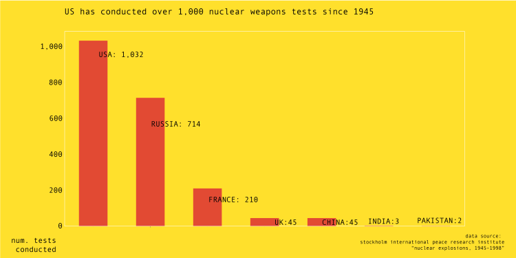
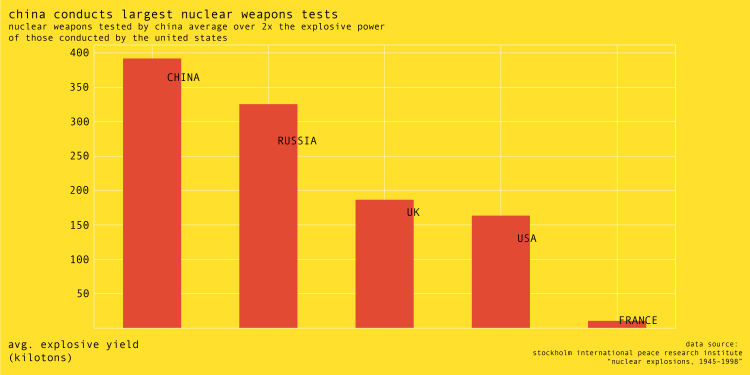
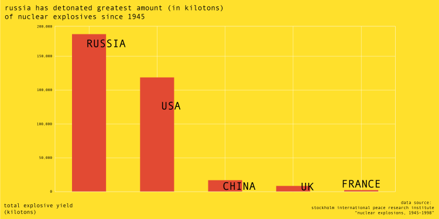
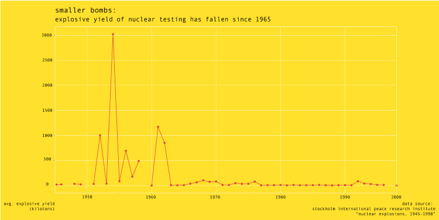

---

title: Most popular name for nuclear tests? It's a star

---

# Most popular name for nuclear tests? It's a star

Since 1945, the United States has conducted over 1,000 nuclear tests with a combined explosive yield of 100,000 kilotons (1 kiloton is the equivalent of 1,000 tons of TNT). Fifteen of these tests have been named after the star Vega, the second brightest star in the northern hemisphere and one that is twice as massive as the sun, and another five have been named after the constellation, Lyra, of which Vega is a part.

Although the US has conducted the greatest number of nuclear tests, China's nuclear tests, have, on average, an explosive yield twice as great as those conducted by the United States, and Russia's test program far outstrips both China and the United States in the total amount of explosives detonated, with nearly 200,000 kilotons.

Although global stockpiles and the average explosive yield has fallen drastically over the years-stockpiles have been reduced to 14,900 in 2017 from an estimated 70,300 in 1986, according to the Federation of American Scientists, the Federation notes that "today's forces are vastly more capable... Instead of planning for nuclear disarmament, the nuclear-armed states appear to plan to retain large arsenals for the indefinite future."

Sources: Federation of American Scientists, Stockholm International Peace Research Institute

